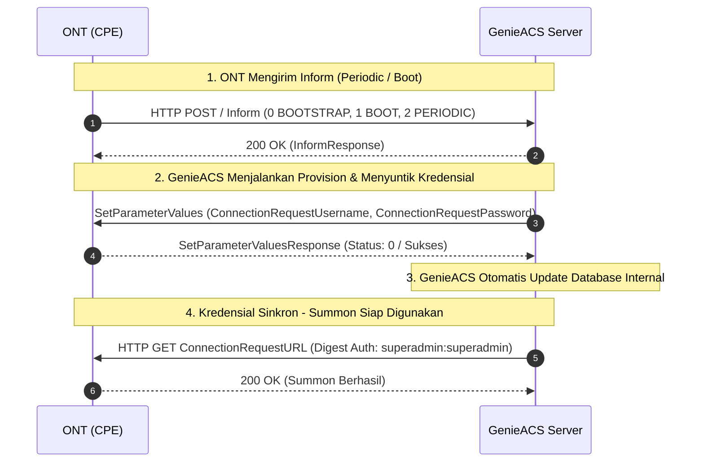

# Catatan Teknis: Injeksi Connection Request Credentials ke ONT via GenieACS

Dokumen ini mencatat mekanisme dan konfigurasi untuk mengatasi masalah autentikasi Connection Request (*Summon*) serta sinkronisasi kredensial TR-069 pada ONT (ZTE, Fiberhome, dsb).

---

## 1. Masalah & Indikasi
- **Error pada UI GenieACS:**
  > `Connection request error: Incorrect connection request credentials`
- **Penyebab:**
  Database GenieACS mencatat username / password yang tidak cocok dengan nilai yang tersimpan di memori (NVRAM) ONT. Kondisi ini umumnya terjadi saat:
  1. ONT di-reset atau diganti perangkat baru.
  2. Template konfigurasi OMCI / TR-069 dari OLT menggunakan kredensial bawaan vendor yang berbeda.
  3. Terjadi *mismatch* saat registrasi pertama kali ke ACS.

---

## 2. Prinsip Two-Way Push (Sinkronisasi Otomatis)

Saat modem *idle*, ACS tidak bisa melakukan "Summon" jika kredensial di ONT salah. Solusinya adalah memanfaatkan alur **ONT yang menghubungi ACS** (*Inform Session*):



---

## 3. Langkah Konfigurasi GenieACS

### A. Daftarkan Script Provision (`update_auth`)
Buat provision baru di menu **Admin > Provisions** (atau via NBI API `PUT /provisions/update_auth`):

```javascript
// Target parameter TR-069 ManagementServer
const mgmt = "InternetGatewayDevice.ManagementServer.";

// 1. Suntikkan username dan password Connection Request ke ONT
declare(mgmt + "ConnectionRequestUsername", {value: 1}, {value: "superadmin"});
declare(mgmt + "ConnectionRequestPassword", {value: 1}, {value: "superadmin"});

// 2. Aktifkan Periodic Inform agar ONT rutin menyapa ACS
declare(mgmt + "PeriodicInformEnable", {value: 1}, {value: true});
declare(mgmt + "PeriodicInformInterval", {value: 1}, {value: 300}); // Tiap 300 detik (5 menit)
```

> **Catatan Sintaks:**
> - `{value: 1}` pada argumen kedua memastikan GenieACS mengirim perintah commit/tulis ke ONT (*CPE write*).
> - Nilai `"superadmin"` adalah contoh kredensial standar yang disepakati untuk ACS dan ONT.

### B. Hubungkan ke Preset (Triggers)
Di menu **Admin > Presets**, buat rule baru:
- **Name:** `update_auth`
- **Events:**
  - `0 BOOTSTRAP` (Saat ONT pertama kali terdeteksi)
  - `1 BOOT` (Saat ONT reboot / baru dinyalakan)
  - `2 PERIODIC` (Saat detak jantung rutin ONT dikirim)
- **Weight:** `0`
- **Provisions:** `update_auth` (atau disatukan ke dalam provision `default`)

---

## 4. Automasi via REST API / NBI (Node.js Script)

Jika ingin mengaplikasikan langsung via terminal / server backend:

```javascript
const http = require('http');

const provisionScript = `
const mgmt = "InternetGatewayDevice.ManagementServer.";
declare(mgmt + "ConnectionRequestUsername", {value: 1}, {value: "superadmin"});
declare(mgmt + "ConnectionRequestPassword", {value: 1}, {value: "superadmin"});
declare(mgmt + "PeriodicInformEnable", {value: 1}, {value: true});
declare(mgmt + "PeriodicInformInterval", {value: 1}, {value: 300});
`;

const req = http.request({
  hostname: '127.0.0.1', // sesuaikan dengan IP server GenieACS
  port: 7557,
  path: '/provisions/update_auth',
  method: 'PUT',
  headers: { 'Content-Type': 'text/plain' }
}, (res) => {
  console.log(`Update provision status: ${res.statusCode}`);
});

req.write(provisionScript);
req.end();
```

---

## 5. Tips Percepat Sinkronisasi Kredensial
1. **Reboot ONT:** Bila tidak ingin menunggu timer *Periodic Inform* (misal interval 5-10 menit), cukup matikan-nyalakan modem pelanggan atau kirim perintah reboot dari OLT. Begitu ONT menyala, ia langsung mengirim event `1 BOOT` dan seketika disuntik kredensial baru.
2. **Kredensial Default Pabrikan:** Jika modem baru dipasang dan belum terinjeksi, kredensial default yang sering digunakan vendor ONT antara lain:
   - `admin` : `admin`
   - `zte` : `zte`
   - `user` : `user`
   - `superadmin` : `superadmin`
